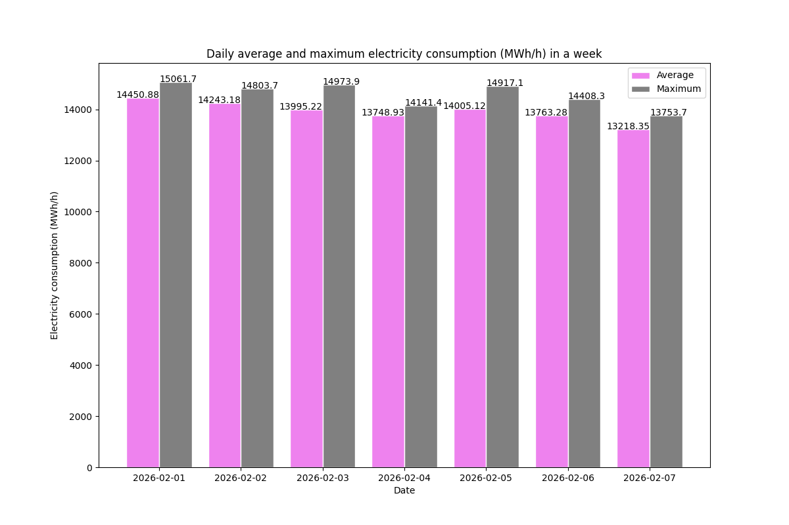

# Electricity consumption application
## Idea of application
The application creates a daily electricity consumption chart of a selected week in Finland.
- Data is fetched from the Fingrid Open API.
- The user chooses a start date and data is collected for the following week.
- Daily averages and maximum values are calculated for each date.
- A chart is created which contains the average and maximum values.
- The chart is created as an image and saved to the project folder for viewing. 

## API key
Data is obtained from the Fingrid Open API.
- Instructions for API key generation can be found from the site https://data.fingrid.fi/en/instructions.

Key configuration
- Create a .env file to project root directory.
- Add generated API key as FINGRID_API_KEY=your_key
- The key is loaded with dotenv

## Installation and running
- Clone the repository <https://github.com/annakoskinen/COMP.SE.221-Sustainable-software-engineering-assignments.git>
- In the Assignment4_electricity_consumption folder:
    - Install required libraries found in requirements.txt with 'pip install -r requirements.txt'
    - Run the application with command 'python main.py'

## An example run
- The application first prints some info about it
- Then start date is asked as an input from the user
- The generated chart is saved as an image and its name is printed

"## Electricity consumption in Finland ##"

"# average and the highest value per day in a week from a chosen start date #"

Input start in format YYYY-MM-DD

Start date: 2026-02-01

Chart saved as electricity_consumption.png

